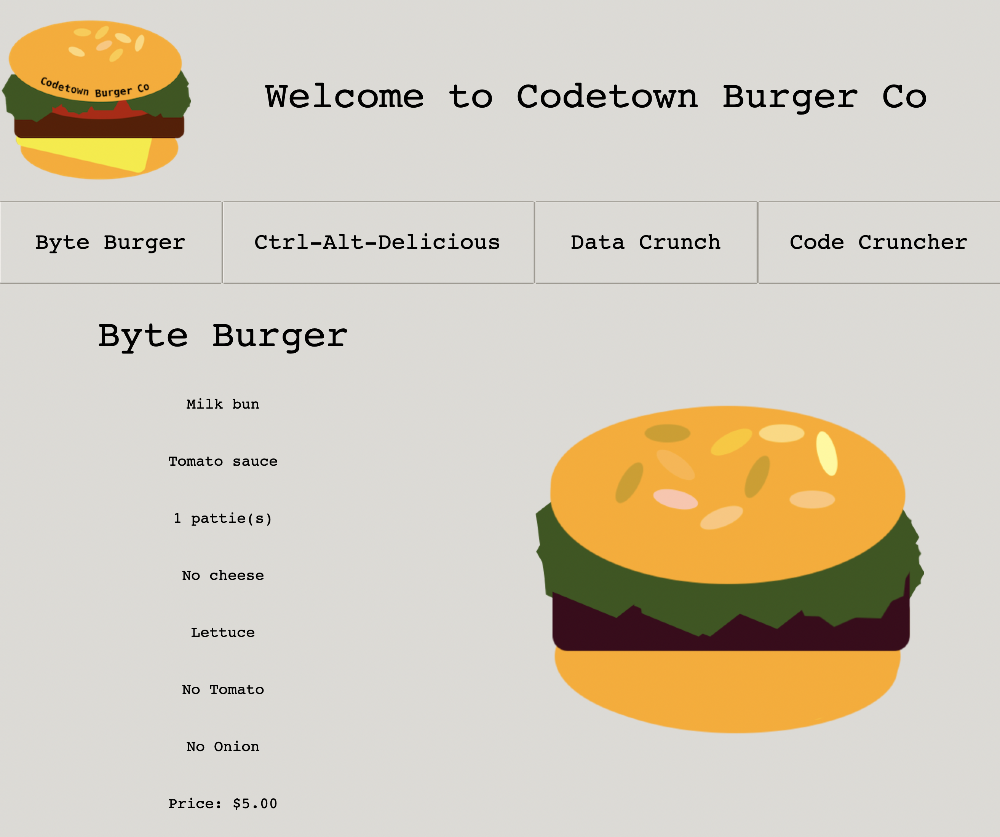

# COSC110 - ASSIGNMENT 2
This program is a solution for our loyal customer "Codetown burger Co". They have once again returned to us with
a problem they would like solved. This time they would like to implement a graphical user interface for their customers
to view the menu at any of their in store locations.

## How to launch
Start the program by running: 
```
'python3 menu.py'
```

How to use
- By simply running the command above you will launch the Graphical user interface.
- The interface will automatically scroll for you between all the burger options and 
display the contents of each burger
- If you would like to look at a particular burger you can click any of the names of the burger which are located 
under the logo.
- Each option will stay on screen for 5 seconds before changing to the next one 

Thats all there is to it, a very simple implementation of the customers request, below is a sample screenshot
of the program in action.
## Example Screenshot

 - A screenshot of the interface showing the byte burger




All images used in the final implementation of this product were created by Joshua Hahn In accordance with our 
agreement with Codetown Burger Co.

## Contact Information
- Author: 
- Email: 
